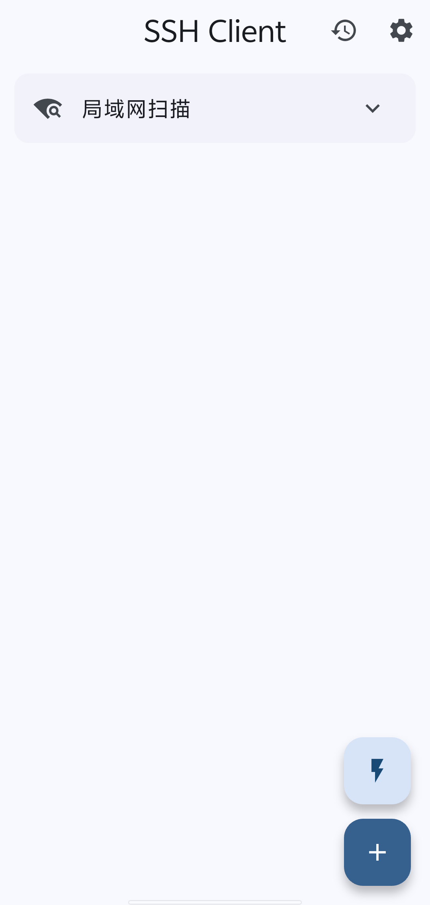
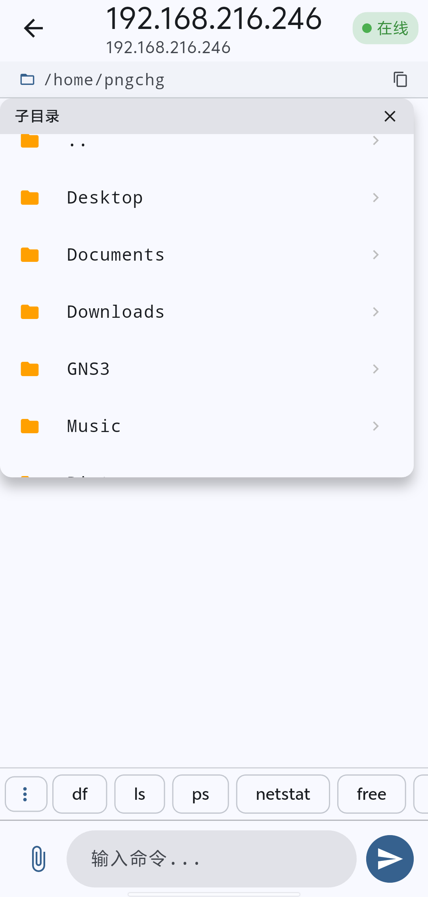
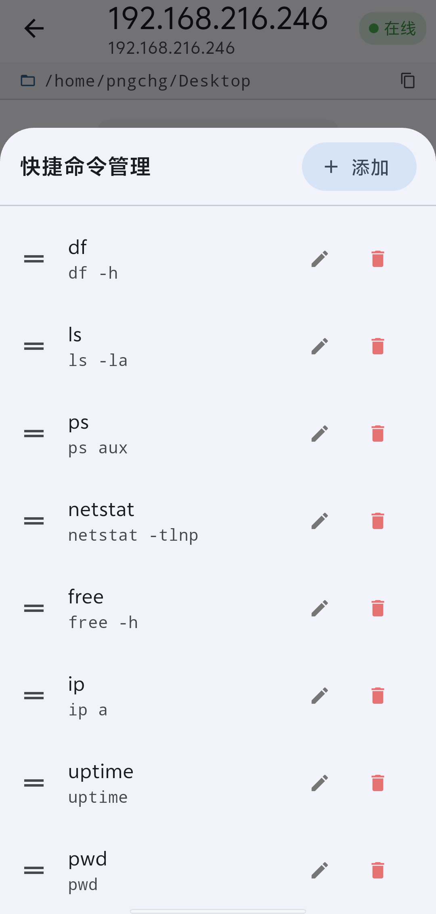
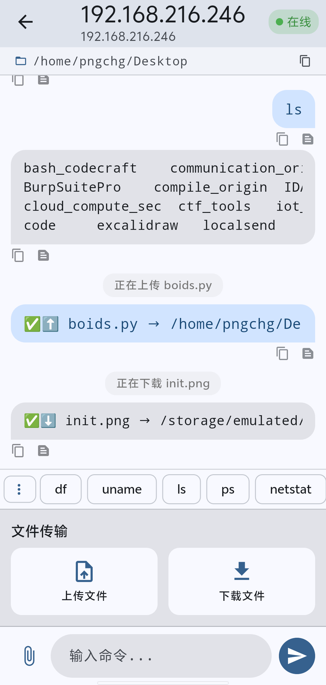

# SSH Client

基于 Flutter 构建的 Android SSH 客户端，支持会话管理、SCP 文件传输、局域网扫描和交互式命令执行。

## 功能特性

- **SSH 连接** — 密码认证连接远程主机，支持会话持久化
- **命令执行** — 交互式命令终端，自动追踪工作目录（`cd` 包装 + `pwd` 解析）
- **目录浏览** — 顶栏显示当前路径，点击通过 `ls -la` 列出子目录
- **文件传输 (SCP)** — 通过 SSH 连接上传/下载文件
- **会话管理** — 离开聊天页时可保持会话活跃，无缝重连
- **历史记录** — 按会话保存消息历史，支持搜索和回放
- **局域网扫描** — 批量 TCP 端口扫描（每批 100 IP，3 秒间隔），支持暂停/继续/停止
- **快捷命令** — 可自定义的命令芯片，支持添加/编辑/删除/拖拽排序
- **主机管理** — 已保存主机的编辑/删除，连接状态指示
- **主题** — 深色模式切换，Material3 设计

## 运行截图

|  |  |
|---|---|
|  |  |
|  |  |

## 技术栈

| 组件 | 技术 |
|-----------|-----------|
| 框架 | Flutter 3.41.9 |
| 语言 | Dart 3.11.5 |
| SSH | dartssh2 2.17.1 |
| 状态管理 | Riverpod 2.6.1 |
| 数据库 | SQLite (sqlite3) |
| 最低 Android API | 34 |
| 目标 Android API | 35 |

## 架构

```
主页 (主机列表 + 局域网扫描)
  └── 聊天页
       ├── 路径栏 (目录浏览)
       ├── 消息列表
       │    ├── 命令 (右对齐)
       │    ├── 输出 (左对齐)
       │    ├── 系统 (居中)
       │    └── 文件传输 (TransferBubble)
       ├── 快捷命令芯片 (可自定义)
       ├── 文件面板 (上传/下载)
       └── 输入栏
```

**命令执行引擎：**
每条命令包装为 `cd "<当前pwd>" && <命令> && pwd`。输出末行解析为新的工作目录，其余行和 stderr 作为命令输出显示。

**会话生命周期：**
- 会话通过唯一 ID（主机信息 + 时间戳生成）追踪
- 活跃会话保留在内存中；离开聊天页时选择"保持会话"即可保留
- 断开连接时设置 `endTime`，将会话移至历史记录
- 重新进入保持的会话时，通过 `cd "$lastDir" && pwd` 恢复工作目录

## 数据库表

| 表 | 用途 |
|-------|---------|
| `hosts` | 保存的 SSH 主机及凭据 |
| `sessions` | 连接会话及时间信息 |
| `chat_messages` | 命令/输出/系统消息 |
| `transfer_tasks` | 文件传输记录 |
| `quick_commands` | 用户自定义命令快捷键 |

## 安全说明

- SSH 密码以明文存储在 SQLite 中（建议启用设备级加密）
- 不捆绑任何 API 密钥、令牌或证书
- Android 14+ 使用 Storage Access Framework (SAF) 下载文件
- **发布构建**目前使用默认调试密钥库 — 发布前请通过 `android/key.properties` 配置发布密钥库

## 构建

### 环境要求

| 工具 | 版本 |
|------|------|
| Flutter | 3.41.9 |
| Dart | 3.11.5 (随 Flutter SDK 捆绑) |
| Java (JDK) | 17 或 21 |
| Android SDK | compileSdk (Flutter 默认) |
| Android Gradle Plugin | 8.11.1 |
| Gradle | 8.14 (Wrapper) |
| Kotlin | 2.2.20 |
| NDK | Flutter 默认版本 |

### 安装步骤

1. **安装 Flutter SDK** — 从 [flutter.dev](https://flutter.dev/docs/get-started/install) 下载 Flutter 3.41.9 或更高版本，并确保 `flutter` 命令已加入 `PATH`。

2. **安装 JDK 17 或 21** — 推荐使用 [OpenJDK](https://openjdk.org/) 或 [Amazon Corretto](https://aws.amazon.com/corretto/)：
   ```bash
   # Ubuntu/Debian (以 21 为例)
   sudo apt install openjdk-21-jdk

   # macOS (Homebrew)
   brew install openjdk@21
   ```

3. **配置 Android SDK** — 通过 [Android Studio](https://developer.android.com/studio) 的 SDK Manager 安装 Android SDK，或使用命令行：
   ```bash
   flutter config --android-sdk /path/to/android-sdk
   ```

4. **接受 Android 许可协议**：
   ```bash
   flutter doctor --android-licenses
   ```

5. **验证环境**：
   ```bash
   flutter doctor
   ```
   确保所有检查项均为绿色。

### 构建 APK

```bash
# 安装依赖
flutter pub get

# 构建 release APK
flutter build apk --release
```

构建产物位于 `build/app/outputs/flutter-apk/app-release.apk`。

> **注意**：发布前请通过 `android/key.properties` 配置发布密钥库，当前使用默认调试密钥库。

## 开源协议

本项目基于 MIT 协议开源。详见 [LICENSE](LICENSE) 文件。

## 图标来源

响应设备图标由 mobirise 提供，来源于 <a href="https://icon-icons.com/zh/authors/581-mobirise">Icon-Icons.com</a>。
